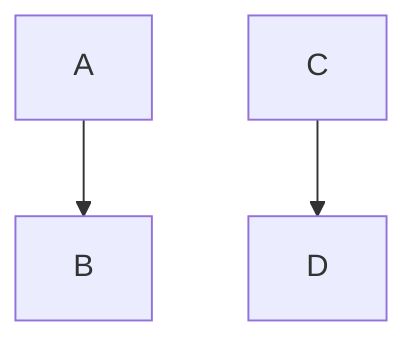
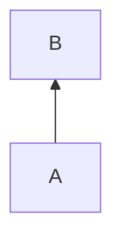
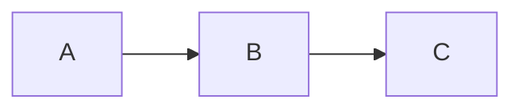
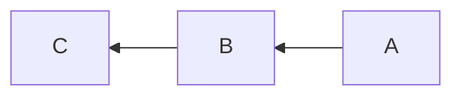
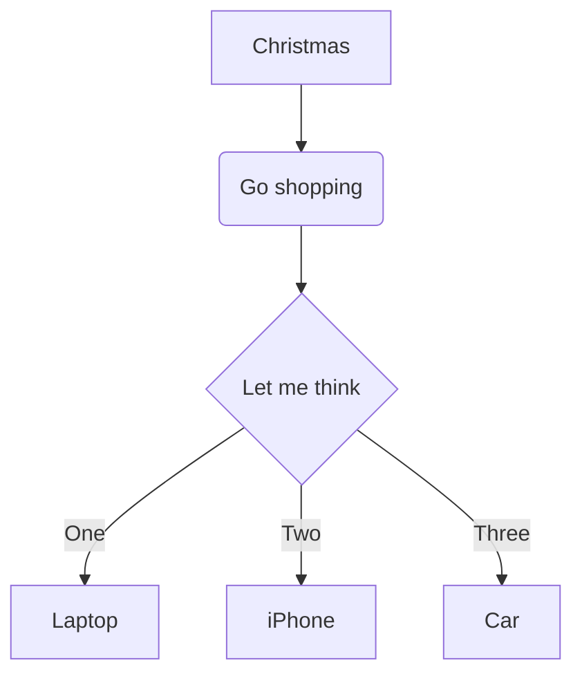
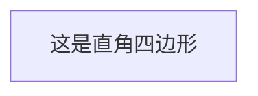
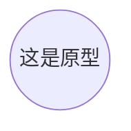
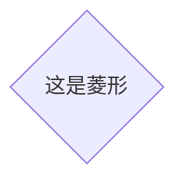
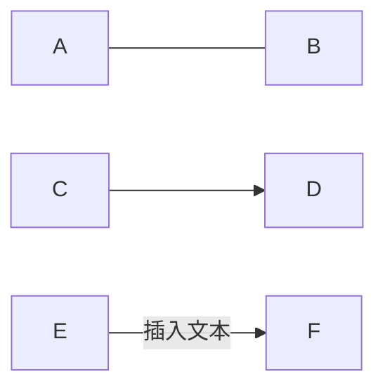
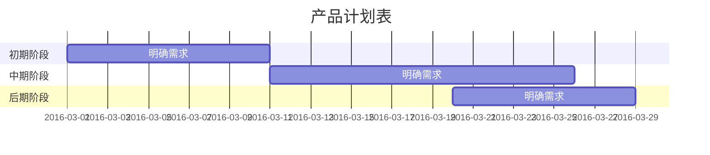

[有道云笔记的markdown模板](https://www.renrendoc.com/paper/97361281.html)

[有道云笔记的markdown模板](https://www.cnblogs.com/wufenfen/p/11449428.html)

# 0代办清单

### TO-do List

*   [x] 已完成项目1

    *   [x] 已完成事项1
    *   [x] 已完成事项2
*   [ ] 待办事项1
*   [ ] 待办事项2

# 1流程图

## 自上而下的顺序



###### 自下而上的顺序



###### 从左到右的顺序



###### 从右到左的顺序



#### 流程图案例



##### 对线框形状的调整







##### 对箭头的调整



# 2甘特图



### 代码高亮

```python
@requires_authorization
def somefunc(param1='', param2=0)
  '''A docstring'''
  if param1 > param2: # interesting
    print 'Greater'
  return (param2 - param1 + 1) or None
class SomeClass:
  pass
>>> message = '''interpreter
... prompt'''
```

### 表格

<span id="表格"></span>

| Item     |    Value |  Qty |
| :------- | -------: | :--: |
| Computer | 1600 USD |   5  |
| Phone    |   12 USD |  12  |
| Pipe     |    1 USD | 1234 |

### 书写数学公式

***

## 0标题

# 一级标题

## 二级标题

### 三级标题

#### 四级标题

## 1列表

#### 无序列表

*   列表1
    *   列表1.1
    *   列表1.2
*   列表2
*   列表3

#### 有序列表

1.  列表1
    1.  列表1.1
    2.  列表1.2
2.  列表2
3.  列表3

## 2引用

> 记录，成为更好的自己。--有道云笔记

## 3 粗体与斜体

*这是斜体*\
**这是粗体**

#### 注意：符号与文本之间无须空格

## 4 链接与图片

#### 插入链接

[有道云笔记官网](http://note.youdao.com/)

#### 插入图片


## 5 分割线

这是第一段内容

***

这是第二段内容

## 6 表格

[表格见上](#表格)

## 7 字体、字号、颜色的设置

<font face="黑体">我是黑体字</font>

<font face="微软雅黑">我是微软雅黑</font>

<font face="STCAIYUN">我是华文彩云</font>

<font color="#009988" size="7" face="黑体">color=#009988 size=72 face="黑体"</font>

　<font color="gray" size="7">color=gray</font>
